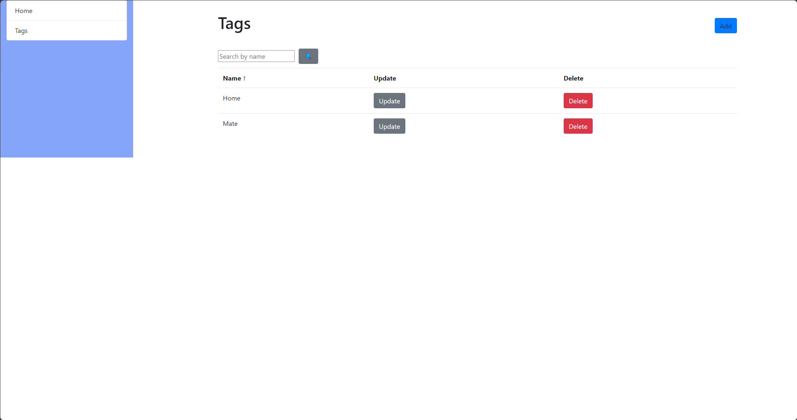
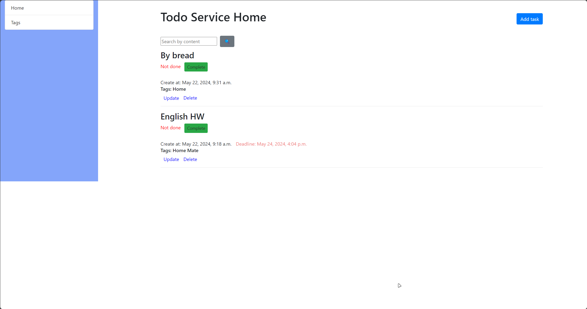

# Todo List Project

This project is a practical exercise in implementing a todo list website. By following the steps outlined below, you'll create a functional todo list with the specified features.

### Models

- **Task**: Represents a todo list item. Each task includes:
  - Content: Description of the task.
  - Creation datetime.
  - Optional deadline datetime.
  - Boolean field indicating if the task is done.
  - Relevant tags associated with the task.
  
- **Tag**: Symbolizes the theme of the task and consists solely of a name. Tasks can have multiple tags, and a tag can be associated with multiple tasks.

### Home Page (127.0.0.1:8000/)

- Sidebar with links to:
  - Home page.
  - Tag list page (sidebar should be present on all pages).
- Todo list:
  - Tasks ordered from not done to done and from newest to oldest.
  - Display all task information.
  - Button to add a new task.
  - Links for updating and deletion of each task.
  - Buttons for completing or undoing a task's status.
- Sample Home Page Design: [Add Sample Image]

### Tag List Page (127.0.0.1:8000/tags/)

- Table displaying tag names with links for updating and deletion.
- Button to add a new tag.
- Implementation of pages for adding tags and tasks.

Sample Tag List Page Design: [Add Sample Image]

## Getting Started

To get started with this project, follow these steps:

1. Clone this repository to your local machine.
2. Set up your development environment.
3. Implement the todo list project according to the provided specifications.
4. Create a Pull Request and attach images of your interface.
5. Submit the Pull Request as the solution for this task.
6. python manage.py runserver 
7. Go to 127.0.0.1:8000

## Screenshots:

